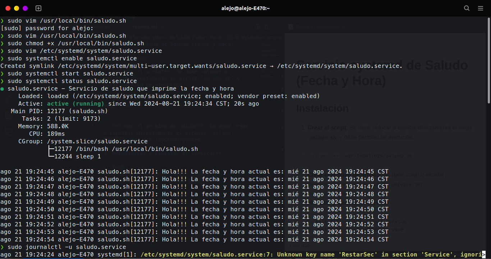

# Servicio systemd de Saludo (Fecha y Hora)

## Instalación

1. **Crear el script**: Se debe colocar o escribir directamente el script `saludo.sh` y darle permiso de ejecución.

```bash
sudo chmod +x /usr/local/bin/saludo.sh
```

2. **Crear el archivo de unidad**: Se debe crear o escribir directamente el archivo `saludo.service` en `/etc/systemd/system/`.

3. **Habilitar y ejecutar el servicio**:

```bash
sudo systemctl enable saludo.service
sudo systemclt start saludo.service
```

## Verificación del servicio

Para verificar el estado del servicio:

```bash
sudo systemctl status saludo.service
```

## Logs

Para ver los logs generados por el servicio:
```bash
sudo journalctl -u saludo.service
```

## Detener el servicio

Para detener el servicio se puede utilizar el siguiente comando:

```bash
sudo systemctl stop saludo.service
```

## Desabilitar servicio

Si el objetivo es deshabilitar para que no inicie automaticamente después de un renicio:

```bash
sudo systemctl disable saludo.service
```
