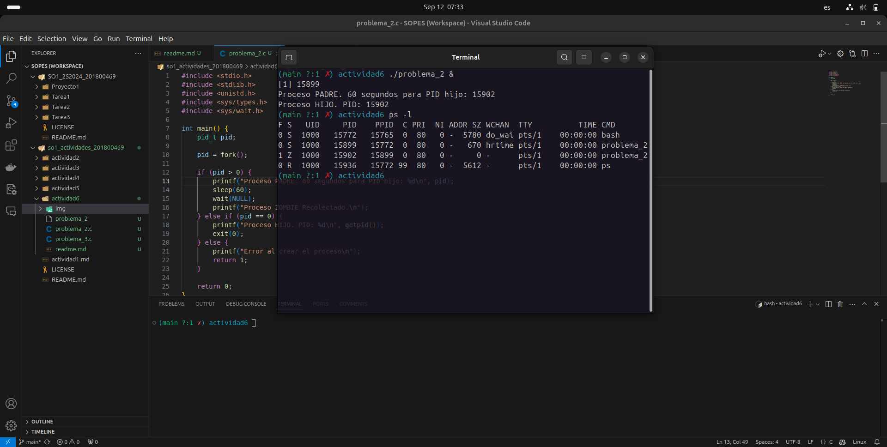
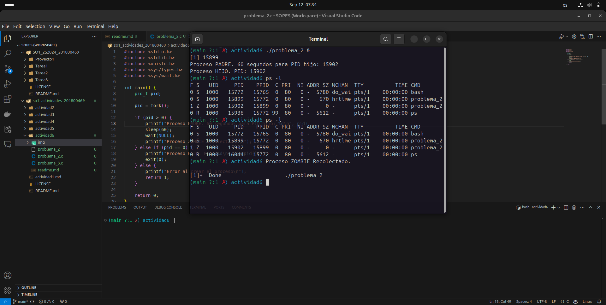
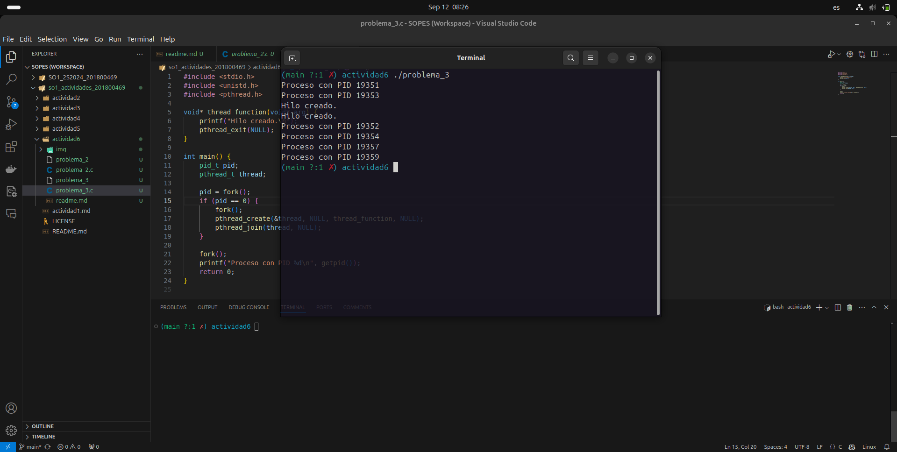

# Problema 1
## Razonamiento
```C
#include <stidio.h>
#include <unistd.h>

int main()
{
    /* fork a child process */
    fork();

    /* fork another child process */
    fork();
    
    /* and fork another */
    fork();

    return 0;
}
```
Teniendo en cuenta el proceso padre se determina lo siguiente:

* El primer `fork()` genera un hijo que se adjunta al proceso padre.
* El segundo `fork()` genera un proceso hijo para el proceso padre y para el hijo generando en total de cuatro procesos.
* El tercer `fork()` genera un proceso hijo para los cuatro procesos ya que tenemos el proceso padre y 3 hijos teniendo en total ocho procesos en total.

Respuesta final se generan `8` procesos.

# Problema 2

Para ejecutar el compilado en C se debe utilizar el siguiente comando:
```bash
./problema_2 &
```
Esto ejecuta el programa pero sin bloquear de manera principal la bash durante los 60 segundos del proceso zombie

* Proceso Zombie en ejecución:

<div align="center">
  
</div>

* Proceso finalizado:

<div align="center">
  
</div>

# Problema 3

* Código Original:

```C
    pid_t pid;

    pid = fork();
    if (pid == 0){ /* child process */
        fork();
        thread_create(. . .);
    }
    fork();
```

* Cógido Resultante:

```C
#include <stdio.h>
#include <unistd.h>
#include <pthread.h>

void* thread_function(void* arg) {
    printf("Hilo creado.\n");
    pthread_exit(NULL);
}

int main() {
    pid_t pid; /* Original */ 
    pthread_t thread;

    pid = fork(); /* Original */
    if (pid == 0) { /* Original */
        fork(); /* Original */
        pthread_create(&thread, NULL, thread_function, NULL); /* Original */
        pthread_join(thread, NULL);
    } /* Original */
    fork();/* Original */

    printf("Proceso con PID %d\n", getpid());
    return 0;
}
```
* Generando 6 procesos 1 padre y 5 hijos
* Generando 2 hilos por los dos hijos que se encuentran en el if

<div align="center">
  
</div>