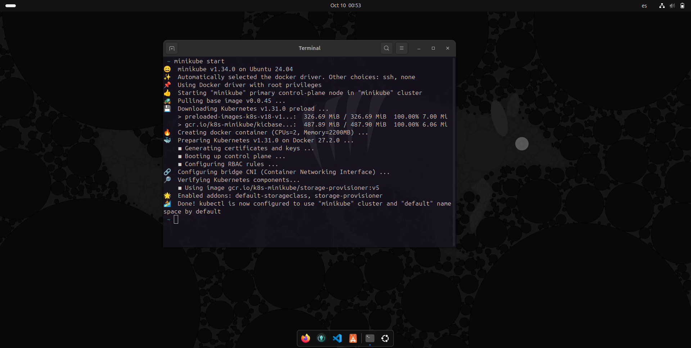
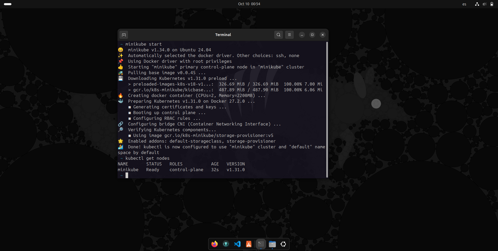
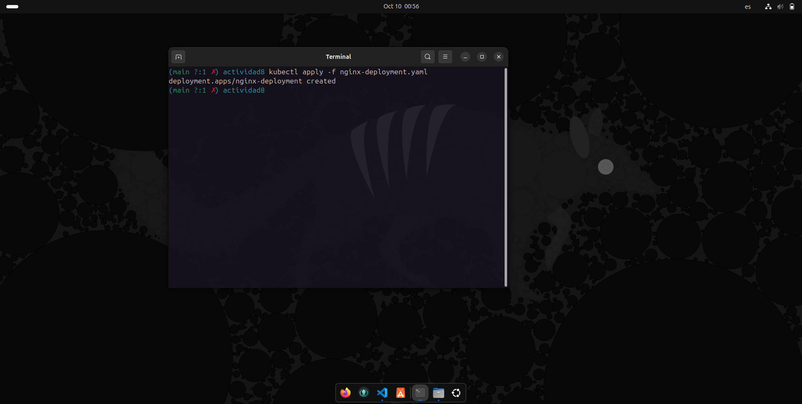
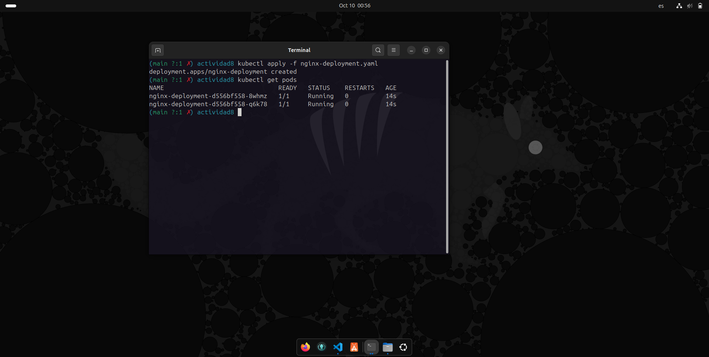
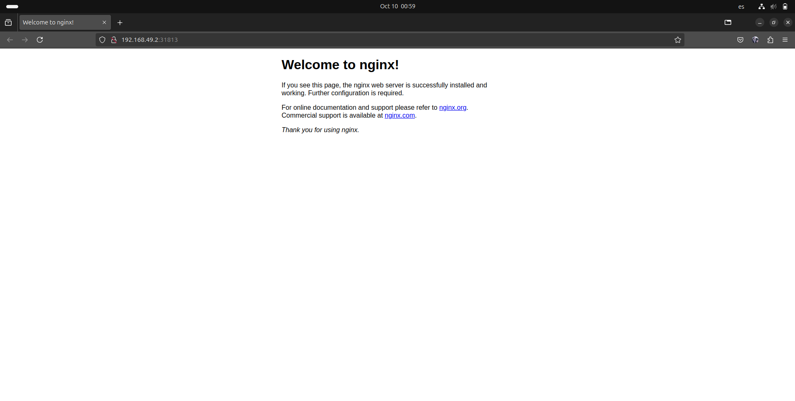

# Actividad 8 - Primeros pasos con K8s

## Paso 1: Instalar Minikube
1. Actualizamos los paquetes e instalamos las dependencias.
2. Descargamos e instalamos Minikube.
3. Iniciamos Minikube con `minikube start`.
4. Verificamos la instalación con `kubectl get nodes`.

## Paso 2: Desplegar un servidor Nginx
1. Creamos un archivo de despliegue `nginx-deployment.yaml`.
2. Aplicamos el despliegue con `kubectl apply -f nginx-deployment.yaml`.
3. Verificamos los pods con `kubectl get pods`.
4. Exponemos el servicio Nginx con `kubectl expose`.

## Paso 3: Respuesta a la pregunta
En un ambiente local de Kubernetes, como el que se utiliza con Minikube o Kind, existe solo un nodo que actúa tanto como nodo master como worker. En un entorno más grande, los nodos master manejan la planificación del clúster y los worker ejecutan los contenedores.

## Ejemplo

  

  

  

  

  

